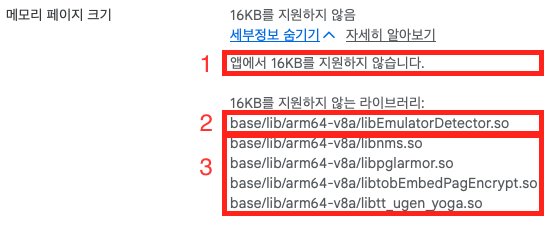

+++
title = "Android 15+ 기기를 대응을 위한 16KB 페이지 크기 지원"
date = 2026-08-28T14:00:00+09:00
tags = ["android", "unity", "cmake", "ndk", "native"]
categories = ["Android"]
summary = "직접 만들어 쓰던 에뮬레이터 디텍터(C++/CMake)의 .so가 16KB 페이지 크기 요구사항에 걸렸다. 문제를 발견한 시점부터 대응을 끝낼 때까지의 기록."
draft = false
+++

## 16KB Google Play 호환성 요구사항

2025년 11월 1일부터 Google Play에 제출되는 신규 앱과 기존 앱 업데이트는, Android 15 이상을
타겟팅한다면 64비트 기기에서 16KB 페이지 크기를 지원해야 한다. 앱 코드를 고치라는 얘기가 아니라
**앱에 들어가는 모든 네이티브 라이브러리(`.so`)가 16KB 경계에 정렬돼 있어야 한다**는 뜻이다.

## 어쩌다 알게 됐나

빌드를 올리자 Play Console에 이런 화면이 떴다.



읽는 법은 단순하다.

1. **결론** — 앱이 16KB를 지원하지 않는다.
2. **직접 빌드한 라이브러리** — `libEmulatorDetector.so`. 앱플레이어를 가려내려고 만들어 쓰던
   네이티브 플러그인이다. 빌드 스크립트가 내 손에 있으니 내가 고칠 수 있다.
3. **서드파티 SDK가 들고 들어온 라이브러리** — `libnms.so`, `libpglarmor.so`,
   `libtobEmbedPagEncrypt.so`, `libtt_ugen_yoga.so`. 이쪽은 제공처가 16KB 대응 버전을 내주기를
   기다리거나 SDK 버전을 올리는 것 말고는 방법이 없다.

즉 같은 경고 안에서도 대응 난이도가 완전히 갈린다. 2번은 오늘 고칠 수 있고, 3번은 남의 일정에
달려 있다. 이 글은 **2번을 어떻게 고쳤는지**에 대한 기록이다.

먼저 한 일은 [Android 공식 문서](https://developer.android.com/guide/practices/page-sizes?hl=ko)를
읽는 것이었다. 요약하면 이렇다. 지금까지 Android는 4KB 메모리 페이지를 전제로 동작해 왔는데,
Android 15부터 16KB 페이지를 쓰는 기기가 등장한다. 공유 라이브러리는 로드될 때 페이지 경계에
맞춰 매핑되므로, 4KB 경계로 링크된 `.so`는 16KB 페이지 기기에서 그대로 올라가지 못한다.
그래서 `.so`를 **16KB 경계에 정렬해서 다시 링크**해야 한다.

결국 손볼 곳은 앱 코드가 아니라 그 `.so`를 만들어 내는 CMake 빌드 스크립트였다.

## 문제가 된 라이브러리 — libEmulatorDetector.so

사용자 디바이스 중에서 앱플레이어를 가려내는 일은 생각보다 까다롭다. BlueStacks, Nox, LDPlayer
같은 앱플레이어는 결국 Windows나 macOS 위에서 도는 **Android 가상 환경**이기 때문이다. 겉으로는
평범한 Android 기기처럼 보이고, 자바 레이어에서 볼 수 있는 정보만으로는 구분이 잘 되지 않는다.
가상 환경이라는 사실이 드러나는 흔적은 대체로 그 아래쪽 — 시스템 프로퍼티, 마운트 정보,
CPU 정보, 앱플레이어마다 남기는 특징적인 파일들 — 에 있다.

그래서 C++로 짜인 오픈소스 구현을 기반으로 필요한 부분을 다듬어, CMake로 빌드해 Unity 네이티브
플러그인으로 쓰고 있었다. 구성은 단순하다.

- **빌드**: Android NDK r27d + CMake, `ANDROID_PLATFORM=android-21`
- **ABI**: `arm64-v8a` 하나만 빌드
- **산출물**: `libEmulatorDetector.so`. STL을 `c++_shared`로 쓰기 때문에 NDK가 주는
  `libc++_shared.so`도 같이 동봉
- **연동**: `extern "C"`로 export한 함수를 C# 쪽에서 `DllImport`로 호출
- **배치**: `Assets/EmulatorDetector/Plugins/Android/` 아래에 `.so` 두 개

여기서 중요한 건 이 `.so`가 Unity가 만들어 주는 것도, 서드파티에게 받은 것도 아니라는 점이다.
빌드 스크립트를 내가 쥐고 있다. 고칠 수 있다는 뜻이다.

## 정말 문제인지 확인하기

`.so`가 몇 바이트 경계로 정렬돼 있는지는 ELF 프로그램 헤더의 `LOAD` 세그먼트 `Align` 값을 보면 된다.

```sh
readelf -lW libEmulatorDetector.so | grep LOAD
```

대응 전 출력은 이랬다.

```
  LOAD           0x000000 0x0000000000000000 0x0000000000000000 0x013110 0x013110 R E 0x1000
  LOAD           0x013110 0x0000000000014110 0x0000000000014110 0x0006e8 0x000ef0 RW  0x1000
  LOAD           0x0137f8 0x00000000000157f8 0x00000000000157f8 0x000020 0x001460 RW  0x1000
```

맨 오른쪽 `Align` 열이 `0x1000`, 즉 4096바이트다. 4KB 정렬이라는 뜻이고, 필요한 값은
`0x4000`(16384)이다. 확실히 이 라이브러리가 걸린 게 맞았다.

같이 넣는 `libc++_shared.so`도 확인해 봤다.

```
  LOAD           0x000000 0x0000000000000000 0x0000000000000000 0x09aca8 0x09aca8 R   0x4000
  LOAD           0x09acb0 0x000000000009ecb0 0x000000000009ecb0 0x096640 0x096640 R E 0x4000
  LOAD           0x1312f0 0x00000000001392f0 0x00000000001392f0 0x009b50 0x009d10 RW  0x4000
  LOAD           0x13ae40 0x0000000000146e40 0x0000000000146e40 0x000238 0x007d10 RW  0x4000
```

이쪽은 이미 `0x4000`이었다. NDK r27이 함께 주는 STL은 애초에 16KB로 링크돼 있다.
결국 고칠 대상은 내가 빌드한 `.so` 하나로 좁혀졌다.

## 시도한 것들

### 시도 1 — 링커에 max-page-size를 직접 넘기기

문서에 나온 대로 링커에 최대 페이지 크기를 지정하면 될 것 같았다. `CMakeLists.txt`에
`target_link_options`로 플래그를 넣었다.

```cmake
cmake_minimum_required(VERSION 3.13)   # target_link_options가 3.13부터
project(EmulatorDetector)

add_library(EmulatorDetector SHARED src/EmulatorDetection.cpp)

target_link_options(EmulatorDetector PRIVATE "-Wl,-z,max-page-size=16384")
```

방향 자체는 틀리지 않았다. `-z max-page-size`는 실제로 세그먼트 정렬을 결정하는 링커 옵션이다.
문제는 NDK r27에 이 목적을 위한 공식 스위치가 따로 있다는 걸 모른 채, 링커 플래그를 손으로
꽂아 넣고 있었다는 것이다.

### 시도 2 — 이름이 비슷한 것들을 전부 켜기

NDK 문서에서 `ANDROID_SUPPORT_FLEXIBLE_PAGE_SIZES`라는 이름을 보고, 이걸 켜야 하는구나 싶어
CMakeLists에 관련돼 보이는 것들을 몰아넣었다.

```cmake
# For NDK r27+
set(CMAKE_ANDROID_APP_SUPPORT_FLEXIBLE_PAGE_SIZES ON)
target_compile_definitions(EmulatorDetector PRIVATE
    APP_SUPPORT_FLEXIBLE_PAGE_SIZES=1
)
target_link_options(EmulatorDetector PRIVATE
    "-Wl,-z,max-page-size=16384"
    "-Wl,-z,common-page-size=16384"
    "-Wl,--rosegment"
    "-Wl,-z,separate-loadable-segments"
)
```

셋 다 헛발질이었다.

- `set(CMAKE_ANDROID_APP_SUPPORT_FLEXIBLE_PAGE_SIZES ON)` — 그런 이름의 변수를 읽는 쪽이 없다.
  NDK 툴체인 파일이 보는 이름은 `ANDROID_` 접두사 쪽이고, 무엇보다 **툴체인 파일은 CMakeLists.txt를
  읽기 전에 이미 처리된다.** CMakeLists 안에서 `set` 해봐야 늦는다.
- `target_compile_definitions(...)` — 페이지 정렬은 링크 단계에서 세그먼트를 어디에 배치하느냐의
  문제다. 컴파일 시점 매크로와는 아무 상관이 없다.
- `--rosegment`, `-z separate-loadable-segments` — 세그먼트를 더 잘게 나누는 옵션이다. 정렬과는
  직접 관계가 없고, 결과적으로 `.so`만 커졌다. 985,472 → 1,003,912바이트, 약 18KB가 늘었다.

이름이 그럴듯해 보이는 옵션을 한꺼번에 켜는 방식은 대개 문제를 풀지 못한다. 정확히는, 풀렸는지
안 풀렸는지도 알 수 없게 만든다.

## 실제로 해결한 방법

답은 `CMakeLists.txt`가 아니라 **빌드 스크립트의 cmake configure 단계**에 있었다. 플래그 한 줄이다.

```bat
cmake -G "MinGW Makefiles" ^
  -DCMAKE_TOOLCHAIN_FILE="%CMAKE_TOOLCHAIN_FILE%" ^
  -DANDROID_ABI=arm64-v8a ^
  -DANDROID_PLATFORM=android-21 ^
  -DCMAKE_BUILD_TYPE=Release ^
  -DANDROID_STL=c++_shared ^
  -DANDROID_SUPPORT_FLEXIBLE_PAGE_SIZES=ON ^
  -DCMAKE_MAKE_PROGRAM="%ANDROID_NDK_HOME%\prebuilt\windows-x86_64\bin\make.exe" ^
  ..
```

`ANDROID_ABI`, `ANDROID_PLATFORM`, `ANDROID_STL`과 마찬가지로
`ANDROID_SUPPORT_FLEXIBLE_PAGE_SIZES`도 **NDK 툴체인 파일이 읽는 값**이다. 그리고 툴체인 파일은
configure가 시작될 때 가장 먼저 처리된다. 그래서 `-D`로 커맨드라인에서 넘겨야 하고,
CMakeLists.txt 안에서 `set` 하는 것으로는 절대 켤 수 없다. 시도 2가 실패한 이유가 여기 있었다.

CMakeLists.txt는 오히려 덜어냈다.

```cmake
# 변경 전 (시도 2)
set(CMAKE_ANDROID_APP_SUPPORT_FLEXIBLE_PAGE_SIZES ON)
target_compile_definitions(EmulatorDetector PRIVATE
    APP_SUPPORT_FLEXIBLE_PAGE_SIZES=1
)
target_link_options(EmulatorDetector PRIVATE
    "-Wl,-z,max-page-size=16384"
    "-Wl,-z,common-page-size=16384"
    "-Wl,--rosegment"
    "-Wl,-z,separate-loadable-segments"
)
```

```cmake
# 변경 후
target_link_options(EmulatorDetector PRIVATE
    "-Wl,-z,max-page-size=16384"
    "-Wl,-z,common-page-size=16384"
)
```

링커 플래그 두 줄은 남겨 뒀다. 툴체인 스위치가 켜져 있으면 이 두 줄이 없어도 결과는 같다.

참고로 이 스위치가 필요한 건 NDK r27이기 때문이다. 공식 문서에 따르면 r28부터는 16KB 정렬이
기본값이라, NDK를 올릴 수 있는 상황이라면 플래그 없이 해결되는 문제이기도 하다.

## 검증

같은 명령을 다시 돌렸다.

```sh
readelf -lW libEmulatorDetector.so | grep LOAD
```

```
  LOAD           0x000000 0x0000000000000000 0x0000000000000000 0x013110 0x013110 R E 0x4000
  LOAD           0x013110 0x0000000000017110 0x0000000000017110 0x0006e8 0x000ef0 RW  0x4000
  LOAD           0x0137f8 0x000000000001b7f8 0x000000000001b7f8 0x000020 0x001460 RW  0x4000
```

`Align`이 세 세그먼트 모두 `0x4000`, 16384바이트다.

파일 크기 변화도 기록해 둘 만하다.

| 시점 | 크기 |
|---|---|
| 대응 전 | 985,472 바이트 |
| 시도 2 (불필요한 세그먼트 분리 옵션 포함) | 1,003,912 바이트 |
| 최종 | 985,472 바이트 |

16KB 정렬 자체는 파일 크기를 늘리지 않았다. 시도 2에서 늘어났던 18KB는 정렬과 무관한
`--rosegment` / `separate-loadable-segments` 때문이었다는 뜻이다. 코드가 바뀐 게 아니라
세그먼트 배치만 바뀌었으니 당연한 결과이기도 하다.

## 남은 것들 / 배운 것

| 확인 항목 | 상태 |
|---|---|
| 직접 빌드한 `libEmulatorDetector.so` | 16KB 정렬 완료 |
| NDK 동봉 `libc++_shared.so` | 원래부터 16KB (`0x4000`) |
| 지원 ABI | `arm64-v8a` 단일 — 16KB 요구사항은 64비트 기기 대상 |
| 서드파티 SDK의 `.so` 4종 | 직접 대응 불가 — SDK 업데이트 대기 |

다시 같은 상황을 만난다면 이 순서로 갈 것 같다.

1. **걸린 파일 목록부터 확보.** Play Console이 이미 알려주지만, 업로드 전에 알고 싶다면
   APK/AAB 안의 `.so`를 전부 뽑아 `readelf -lW ... | grep LOAD`로 `Align`을 확인하면 된다.
2. **내가 빌드하는 것과 받아 쓰는 것을 나눈다.** 전자는 빌드 옵션으로 끝나고, 후자는 버전 업데이트나
   제공처 문의밖에 방법이 없다. 대응 난이도가 완전히 다르다.
3. **내가 빌드하는 건 툴체인 스위치를 먼저 찾는다.** 링커 플래그를 손으로 넣기 전에, NDK가 이미
   제공하는 공식 옵션이 있는지 확인한다.

가장 크게 남은 건 세 번째다. 빌드 옵션이 안 먹을 때는 옵션 이름을 의심하기 전에 **그 값이 어느
단계에서 읽히는가**를 확인해야 한다. 툴체인 변수는 configure가 시작될 때 처리되므로 CMakeLists
안에서는 손댈 수 없다. 이걸 몰라서 켰다고 생각한 옵션이 사실은 꺼져 있었고, 그 상태로 다른 플래그를
계속 얹고 있었다.

<!-- 작성 메모 (렌더링되지 않음)
- "정말 문제인지 확인하기"의 readelf 출력은 저장소에 남아 있는 대응 전 백업(.so.backup)과
  현재 .so에서 실제로 뽑은 값입니다. 당시 실제로 쓰신 확인 방법이 달랐다면(Play Console 경고만
  보고 넘어갔다거나, zipalign -c -P 16 을 썼다거나) 그 부분을 사실대로 바꿔주세요.
- "남은 것들 / 배운 것"의 소회는 커밋 흐름에서 추론해 쓴 것이라, 실제 느낌과 다르면 고쳐주세요.
- 서드파티 4종(libnms / libpglarmor / libtobEmbedPagEncrypt / libtt_ugen_yoga)의 이후 진행
  상황(SDK 버전 올려서 해결됐는지 등)이 있으면 "남은 것들"에 한 줄 추가할 수 있습니다.
-->

## 참고

- [16KB 페이지 크기 지원 — Android 개발자 문서](https://developer.android.com/guide/practices/page-sizes?hl=ko)
